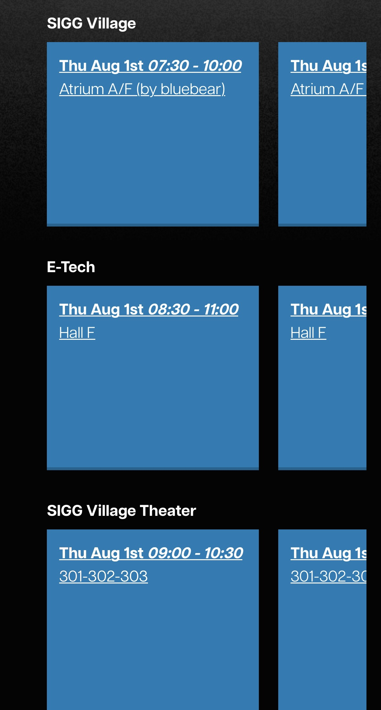
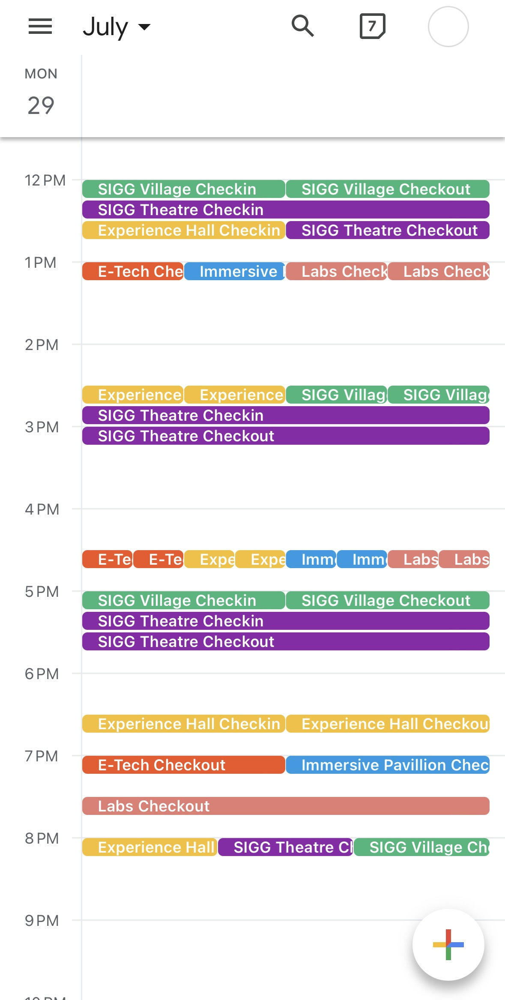

# TLTimetable2GCal

The TL shifts for the SIGGRAPH Student Volunteer program were very overwhelming for me and my teammates this year. This tool adds only the check in and check out times of each shift to your calendar, making your schedule look less overwhelming.

<div style="display: flex; justify-content: center;">
    <div style="text-align: center;">
        
        <div>sv portal</div>
    </div>
    <div style="text-align: center;">
        
        <div>gcal</div>
    </div>
</div>

## Instructions 
1. Follow the Google Calendar set up guide https://developers.google.com/workspace/guides/get-started
2. Add your credentials.json file at the root of the repository
3. Create a JSON File with the date and shifts at each venue like so
```json
{
    "Date": "2024-09-03",
    "Venue 1": [
        "09:00-11:00",
        "11:00-01:00" // add the extra 0 when hour has only 1 digit
    ],
    "Venue 2": [
        "09:00-11:00"
    ]
}
```
4. Run 
```
python3 main.py <path to schedule json>
```